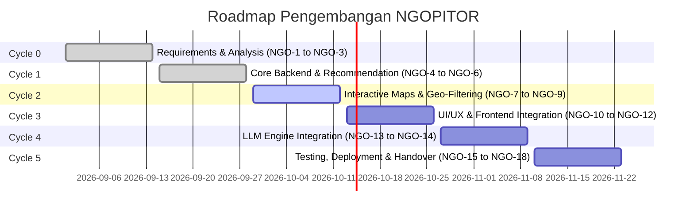

# ☕ NGOPITOR

> **Platform Rekomendasi Kedai Kopi Cerdas & Monitoring Direktori Kafe Berbasis Preferensi, Geolokasi, dan Kecerdasan Buatan (LLM).**

[](https://laravel.com)
[](https://php.net)
[](https://www.postgresql.org/)
[](https://laravel.com/docs/sanctum)
[](tests/)

---

## 📖 Tentang NGOPITOR

**NGOPITOR** hadir untuk memecahkan dilema pencarian tempat ngopi dan ruang kerja (*Work From Cafe / WFC*). Banyak pengunjung kafe kesulitan menemukan kedai kopi yang sesuai dengan kebutuhan spesifik—mulai dari ketersediaan Wi-Fi kencang dan colokan listrik, suasana hening untuk fokus bekerja, tempat estetik untuk berkumpul (*hangout*), hingga kafe yang ramah di kantong mahasiswa.

Aplikasi ini menggabungkan:
1. **Engine Rekomendasi Terbobot (*Multi-Criteria Weighted Scoring*)**: Menghitung persentase kecocokan (*match score*) secara transparan berdasarkan mode kebutuhan (WFC, Hangout, Budget, atau Custom).
2. **RESTful API Berstandar Industri**: Response envelope seragam (`success`, `message`, `data`, `errors`), exception handling terpusat, dan autentikasi token via Laravel Sanctum.
3. **Peta Interaktif & Geo-Filtering**: Pencarian kedai kopi berdasarkan radius jarak pengguna dan lokasi terdekat.
4. **Integrasi Asisten Pintar (LLM Engine)**: Rekomendasi kafe berbasis percakapan natural (*natural language prompting & streaming*).

---

## 👥 Tim Pengembang

| Nama | Peran Utama | Modul / Fokus Area |
| :--- | :--- | :--- |
| **Anandra Dandi Anugrah** | Backend Lead & AI Engineer | Arsitektur API, Skema Database, Logika Rekomendasi, Integrasi LLM Engine, Deployment |
| **Raditya Hafiz Utomo** | Geo-Spatial & Maps Specialist | Desain UX Peta, Integrasi Map SDK, Algoritma Radius & Filter Lokasi, Deployment |
| **Arya Prasetya Putra Albani**| UI/UX & Frontend Engineer | Design System, UI Kit, Prototype Figma, Slicing Komponen Frontend & State Management |
| **Naufal Fakhrie** | Product Owner & QA Lead | Requirements Gathering, Use Cases, User Acceptance Testing (UAT), Dokumentasi Proyek |

---

## 🗺️ Roadmap & Pemetaan Siklus Kerja (Plane)

Proyek ini dikelola menggunakan metodologi Agile dengan pembagian **Cycles (Sprints)** dan tiket ber-identifier `NGO`:



### Rincian Tiket Kerja (Work Items)

| ID | Judul Tiket | Modul | Assignee | Status |
| :--- | :--- | :--- | :--- | :---: |
| **Cycle 0: Requirements & Analysis** |
| `NGO-1` | Requirements Gathering & User Stories | Requirements & Architecture | Naufal Fakhrie | ✅ Done |
| `NGO-2` | Use Case & Activity Diagram Modeling | Requirements & Architecture | Anandra Dandi Anugrah | ✅ Done |
| `NGO-3` | Database Schema Design (ERD) & Data Dictionary | Requirements & Architecture | Anandra Dandi Anugrah | ✅ Done |
| **Cycle 1: Core Backend & Recommendation Logic** |
| `NGO-4` | RESTful API Architecture & Routing Setup | Backend API & Database | Anandra Dandi Anugrah | ✅ Done |
| `NGO-5` | Database Migration & Seeding Data Kedai Kopi | Backend API & Database | Anandra Dandi Anugrah | ✅ Done |
| `NGO-6` | Recommendation Engine Implementation | Backend API & Database | Anandra Dandi Anugrah | ✅ Done |
| **Cycle 2: Interactive Maps & Geo-Filtering** |
| `NGO-7` | Map Interface Wireframing & UX Flow | Map & Geo-Location | Raditya Hafiz Utomo | ⏳ Todo |
| `NGO-8` | Map SDK Integration & Radius Calculation | Map & Geo-Location | Raditya Hafiz Utomo | ⏳ Todo |
| `NGO-9` | Multi-parameter Filter Backend & Logic Integration | Map & Geo-Location | Raditya Hafiz Utomo | ⏳ Todo |
| **Cycle 3: UI/UX & Frontend Integration** |
| `NGO-10` | Design System, UI Kit & Interactive Prototype | Frontend & Mobile UI | Arya Prasetya Putra Albani | ⏳ Todo |
| `NGO-11` | Client UI Component Development & Page Assembly | Frontend & Mobile UI | Arya Prasetya Putra Albani | ⏳ Todo |
| `NGO-12` | API Client Integration & State Management | Frontend & Mobile UI | Arya Prasetya Putra Albani | ⏳ Todo |
| **Cycle 4: LLM Engine Integration** |
| `NGO-13` | LLM Prompt Design & Context Engineering | LLM Engine | Anandra Dandi Anugrah | ⏳ Todo |
| `NGO-14` | LLM API Handler & Streaming Integration | LLM Engine | Anandra Dandi Anugrah | ⏳ Todo |
| **Cycle 5: Testing, Deployment & Handover** |
| `NGO-15` | End-to-End & Integration Testing | QA & Deployment | Anandra, Arya, Raditya | ⏳ Todo |
| `NGO-16` | User Acceptance Testing (UAT) & Validation | QA & Deployment | Naufal Fakhrie | ⏳ Todo |
| `NGO-17` | Production Deployment & Server Environment Setup | QA & Deployment | Anandra, Raditya | ⏳ Todo |
| `NGO-18` | Project Documentation, User Manual & Handover | QA & Deployment | Naufal Fakhrie | ⏳ Todo |

---

## 🛠️ Tech Stack

- **Framework**: [Laravel 12](https://laravel.com)
- **Bahasa**: [PHP 8.3+](https://www.php.net)
- **Database**: [PostgreSQL](https://www.postgresql.org/)
- **Autentikasi**: [Laravel Sanctum](https://laravel.com/docs/sanctum) (Bearer Token API)
- **Automated Testing**: [PHPUnit 12](https://phpunit.de) (Unit & Feature Tests)
- **Code Formatter**: [Laravel Pint](https://laravel.com/docs/pint)

---

## 📡 Dokumentasi Endpoint API (v1)

Semua endpoint API diawali dengan prefix `/api/v1` dan mengembalikan respon JSON standar:

```json
{
  "success": true,
  "message": "Deskripsi respon",
  "data": { ... },
  "errors": null
}
```

### 1. Autentikasi
| Method | Endpoint | Keterangan | Proteksi |
| :--- | :--- | :--- | :---: |
| `POST` | `/api/v1/auth/register` | Mendaftarkan akun user baru & menerbitkan token | Publik |
| `POST` | `/api/v1/auth/login` | Login menggunakan email & password, mengembalikan token | Publik |
| `GET` | `/api/v1/auth/me` | Mengambil data profil user yang sedang login | `auth:sanctum` |
| `POST` | `/api/v1/auth/logout` | Mencabut (*revoke*) token aktif pengguna | `auth:sanctum` |

### 2. Direktori & Pencarian Kedai Kopi
| Method | Endpoint | Keterangan |
| :--- | :--- | :--- |
| `GET` | `/api/v1/coffee-shops` | Menampilkan daftar kedai kopi dengan filter & paginasi |
| `GET` | `/api/v1/coffee-shops/{slug}` | Menampilkan detail lengkap kedai kopi berdasarkan *slug* |

**Query Parameters yang Didukung pada `/api/v1/coffee-shops`:**
- `search` : Kata kunci pencarian nama, alamat, atau deskripsi kafe.
- `city` : Filter berdasarkan nama kota (misal: `Jakarta Selatan`, `Bandung`, `Bogor`, `Yogyakarta`).
- `price_range` : Filter kategori harga (`$`, `$$`, `$$$`).
- `min_price` & `max_price` : Filter rentang harga numerik (Rp).
- `min_rating` : Filter rating bintang minimal (misal: `4.5`).
- `has_wifi`, `has_power_outlets`, `is_ac`, `is_outdoor`, `is_work_friendly`, `has_prayer_room` : Filter boolean fasilitas (`true`/`false`/`1`/`0`).
- `ambiance` : Filter suasana (`aesthetic`, `cozy`, `minimalist`, `nature`, `industrial`).
- `noise_level` : Filter kebisingan (`quiet`, `moderate`, `loud`).
- `sort_by` : `rating` (default), `review_count`, `price_min`, `price_max`, `name`, `wifi_speed_mbps`.
- `sort_order` : `desc` (default) atau `asc`.
- `per_page` : Jumlah data per halaman (default: `15`, maks: `50`).

### 3. Rekomendasi Cerdas (*Scoring Engine*)
| Method | Endpoint | Keterangan |
| :--- | :--- | :--- |
| `GET` | `/api/v1/coffee-shops/recommendations` | Menghasilkan rekomendasi teratas beserta skor kecocokan |

**Parameter Rekomendasi:**
- `mode`:
  - `wfc` *(default)* : Prioritas kecepatan Wi-Fi, colokan melimpah, dan suasana hening untuk kerja/fokus.
  - `hangout` : Prioritas suasana estetik/outdoor, popularitas, dan rating kafe.
  - `budget` : Prioritas harga termurah dan ramah kantong.
  - `custom` : Menghitung skor dari bobot dinamis (`rating_weight`, `wfc_weight`, `comfort_weight`, `price_weight`).
- `city` *(opsional)* : Filter rekomendasi untuk kota tertentu.
- `limit` *(opsional)* : Jumlah rekomendasi teratas (default: `5`, maks: `30`).

**Contoh Respon Rekomendasi:**
```json
{
  "success": true,
  "message": "Coffee shop recommendations generated successfully",
  "data": {
    "mode": "wfc",
    "city": "Jakarta Selatan",
    "total_recommendations": 5,
    "items": [
      {
        "coffee_shop": {
          "id": 3,
          "name": "Kroma Coffee - Dharmawangsa",
          "slug": "kroma-coffee-dharmawangsa",
          "city": "Jakarta Selatan",
          "rating": 4.82,
          "facilities": {
            "has_wifi": true,
            "has_power_outlets": true,
            "is_work_friendly": true
          }
        },
        "match_score": 93.8,
        "match_percentage": "93.8%",
        "score_breakdown": {
          "rating_score": 96.8,
          "wfc_score": 100.0,
          "comfort_score": 95.0,
          "price_score": 75.4
        },
        "highlights": [
          "Rating luar biasa (4.82/5 dari 510+ ulasan)",
          "Koneksi internet cepat 100 Mbps",
          "Colokan melimpah, sangat nyaman untuk WFC",
          "Suasana tenang & kondusif untuk fokus bekerja"
        ]
      }
    ]
  },
  "errors": null
}
```

---

## 🚀 Panduan Instalasi Lokal

### 1. Prasyarat Sistem
- PHP >= 8.3 (dengan ekstensi `pdo_pgsql`, `pgsql`, `mbstring`, `openssl`)
- Composer >= 2.0
- Server PostgreSQL (port default `5432`)
- Laragon / Local Server Environment

### 2. Clone Repository
```bash
git clone https://github.com/anandra00/NGOPITOR.git
cd NGOPITOR
```

### 3. Instalasi Dependensi
```bash
composer install
```

### 4. Konfigurasi Environment
Salin file environment dan generate application key:
```bash
cp .env.example .env
php artisan key:generate
```

Sesuaikan koneksi database PostgreSQL di file `.env`:
```env
DB_CONNECTION=pgsql
DB_HOST=127.0.0.1
DB_PORT=5432
DB_DATABASE=ngopitor
DB_USERNAME=postgres
DB_PASSWORD=postgres
```

### 5. Migrasi & Seeding Database
Jalankan migrasi tabel dan seeding data kedai kopi riil:
```bash
php artisan migrate --seed
```
> *Database akan terisi otomatis dengan 10 kafe populer riil (Titik Temu, Kopi Toko Djawa, Kroma, Raindear, Space Roastery, Popolo, Tanamera, Armor Kopi, Kopi Nako, Kala Cemara) + 15 kafe variatif.*

### 6. Jalankan Pengujian (*Automated Testing*)
Pastikan semua 23 pengujian berjalan sukses:
```bash
php artisan test
```

### 7. Jalankan Server Development
```bash
php artisan serve
```
Akses API di `http://127.0.0.1:8000/api/v1/coffee-shops`.

---

## 🧪 Status Pengujian & Kualitas Kode

Proyek ini menerapkan pengujian otomatis (*Automated Testing*) berbasis PHPUnit untuk setiap fitur yang dibangun:
- **`AuthTest.php`** (8 tests): Registrasi, validasi duplikat email, verifikasi password, login kredensial, proteksi token Sanctum, fetch `/me`, dan logout.
- **`CoffeeShopTest.php`** (8 tests): Paginasi data kafe, pencarian kata kunci, filter kota, filter fasilitas WFC, sorting harga, pengambilan detail slug, error 404 seragam, dan integritas seeder.
- **`RecommendationTest.php`** (5 tests): Logika mode WFC, mode Hangout, mode Budget, filter kota rekomendasi, dan mode bobot kustom.
- **Total Pengujian**: **23 tests | 178 assertions (100% Pass)**.
- **Standar Kode**: Divalidasi dan diformat menggunakan **Laravel Pint**.

---

## 📄 Lisensi

Proyek NGOPITOR dikembangkan di bawah lisensi [MIT](LICENSE).
